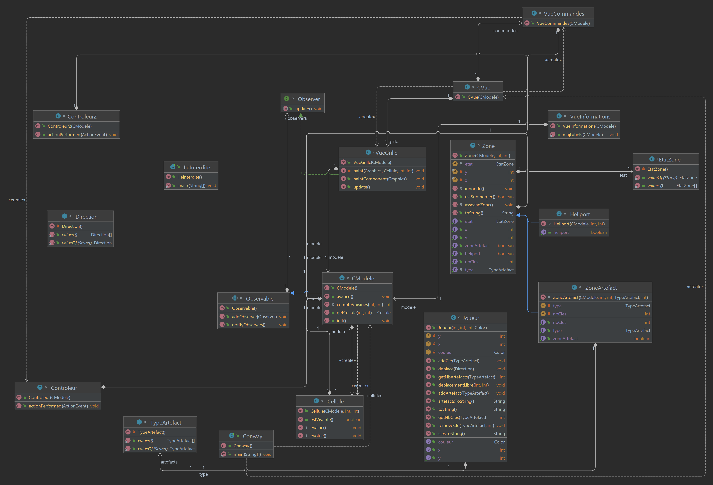

# Projet-Ile-Interdite
 Projet de fin de semestre du cours de POGL en L2 Informatique

Il s'agit du jeu basé sur le jeu Île Interdite.
`2022` - `Java`, `Swing`, `IntelliJ`, `Jeu`

## 1] Avancement dans le projet
Nous avons traité l'ensemble du projet(points "infini" comprit) ainsi que quelques bonus tel que les échanges de clé, des actions spéciale(lancé de sable + déplacement hélico) et des textures

## 2] Diagramme de classe

on a avancé au fur et à mesure sur le projet en même temps et séparément, si travail en même temps on se répartissait sur des parties différentes autrement on regardait quelles ont été les fonctions faits en commun et on prenaît celle qui était la plus performante (ex: la méthode estSumergee qui actuellement faisait 10 lignes fût raccourci en 1 ligne ).
On a séparé les classes dans plusiuers fichier afin que ce soit plus lisible à la fois pour nous et aussi pour ceux et celles qui voudraient regarder le code....

## 3] Problème rencontré durant le projet
Parmi ce qu'on a voulu mettre et qu'on a pas réussi à faire faute de temps.
La partie affichage des artefacts sur le jeu ne sont pas optimiser, on a des artefacts à l'infinie(bonne ou mauvaise chose ?)

## 4] Code emprunté

La boucle de génération de boutons dans VueCommandes fait avec l'aide Florian Pineau : (morceau de la méthode ci-dessous)

-----------------------------------------------------
for (String s : new String[]{"↖", "↑", "↗", "←", "Fin de tour", "→", "↙", "↓", "↘"}) {
    JButton bouton = new JButton(s);
    if ("↖↗↙↘".contains(s)) {
        bouton.setEnabled(false);
    }
    bouton.addActionListener(ctrl2);
    panelBoutons.add(bouton);
}
-----------------------------------------------------
On a récupéré également les textures sur le projet Forbidden Island disponible sur le `github djdhm` (faites une recherche sur google pour le trouver).

