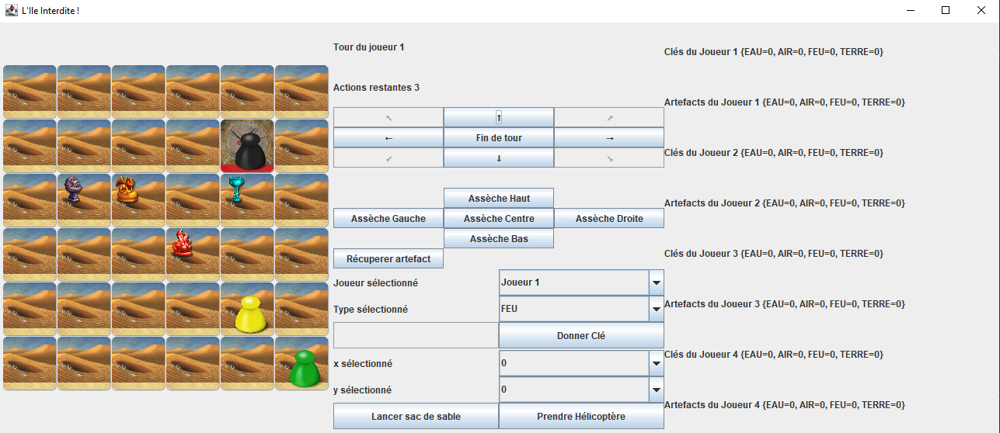
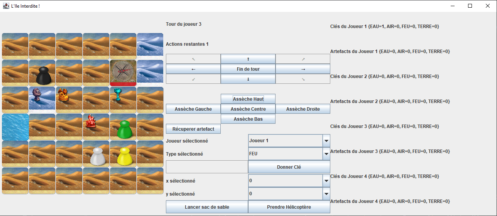
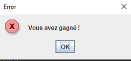
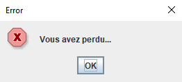

# Projet Ile Interdite
 
Il s'agit de mon projet de fin de semestre pour le cours de Programmation Objet et Génie Logiciel en L2 Informatique.

Ce jeu est basé sur le jeu de plateau l'Île Interdite.

`2022` - `Java`, `Swing`, `Jeu`, `Langage Objet`, `MVC`, `IntelliJ`

### Le jeu en début de partie


### Le jeu en stade un peu plus avancé


### Les écrans de fin de partie



## Conclusion

Pour ce projet réalisé en binôme j'ai obtenu la note de 18.25/20.

Pour obtenir plus d'informations sur ce projet n'hésitez à consulter le sujet : [Sujet](https://github.com/Julien-LG/Projet-Ile-Interdite/blob/main/projet.pdf)

## Compte rendu demandé par le professeur :

### 1] Avancement dans le projet
Nous avons traité l'ensemble du projet (points "infini" compris) ainsi que quelques bonus tel que les échanges de clé et des actions spéciales (lancer de sable + déplacement hélico). Nous avons également ajouté sur la fin des textures.

### 2] Diagramme de classe et organisation
Pour le diagramme de classe nous l'avons modifié au fur et à mesure, la première version se trouve encore sous le nom "v1_uml.jpg" et "v1_uml-2.jpg".
La seconde se trouve sous le nom "v2_Ile_interdite_Projet_UML.pdf".

Le diagramme de classe final quant à lui se trouve ci-dessous. (visible également en ouvrant le fichier "v3_uml.pdf")


Pour l'oragnisation, nous avons avancé au fur et à mesure sur le projet en même temps et séparément, si travail en même temps on se répartissait sur des parties différentes autrement on regardait quelles ont été les fonctions faites en commun et on prenaît celle qui était la plus performante (ex: la méthode estSumergee qui actuellement faisait 10 lignes fût raccourci en 1 ligne ).
On a séparé les classes dans plusieurs fichiers afin que ce soit plus lisible à la fois pour nous et aussi pour ceux et celles qui voudraient regarder le code....

### 3] Problèmes rencontrés durant le projet
Parmi ce qu'on a voulu mettre et qu'on a pas réussi à faire faute de temps.
La partie affichage des artefacts sur le jeu ne sont pas optimiser. 
Nous optenons également des artefacts à l'infinie (bonne ou mauvaise chose ?).

### 4] Code emprunté

La boucle de génération de boutons dans VueCommandes faite avec l'aide Florian Pineau : (morceau de la méthode ci-dessous).

-----------------------------------------------------
```
for (String s : new String[]{"↖", "↑", "↗", "←", "Fin de tour", "→", "↙", "↓", "↘"}) {
    JButton bouton = new JButton(s);
    if ("↖↗↙↘".contains(s)) {
        bouton.setEnabled(false);
    }
    bouton.addActionListener(ctrl2);
    panelBoutons.add(bouton);
}
```
-----------------------------------------------------
Nous avons récupéré également les textures sur le projet Forbidden Island disponible sur le `github djdhm`.

